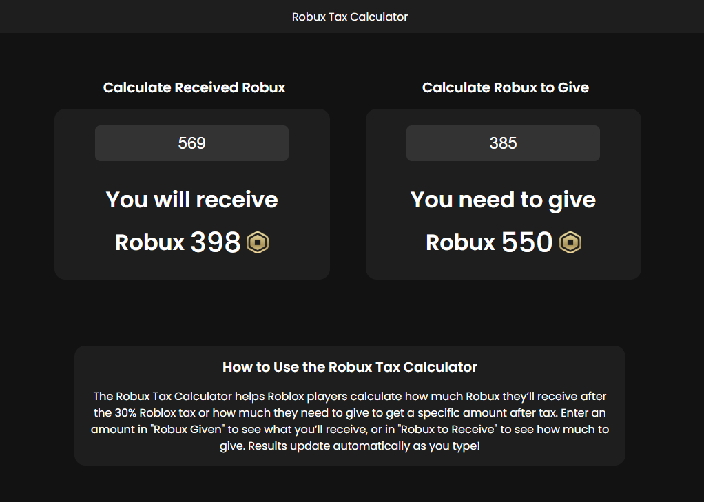

# Robux Tax Calculator

A sleek and intuitive calculator to measure Robux taxes for Roblox players, accounting for the 30% Roblox tax.

- **Modern dark theme** with a clean, user-friendly design
- **Automatic calculations**: Input your Robux amount, and results update instantly
- **Flexible and adaptive layout**: Boxes adjust to the size of your numbers
- **Easy to use**: Simply enter "Robux Given" or "Robux to Receive" to calculate taxes

[Robux Tax Calculator](https://diegoaybar.github.io/RobuxCalculator/)

## Features
- Calculate how much Robux you’ll receive after the 30% tax
- Determine how much Robux you need to give to receive a specific amount
- Large, centered numbers with a Robux icon for clarity
- Responsive design works seamlessly on desktop and mobile

Built with HTML, CSS, and JavaScript by [Diego Aybar](https://github.com/diegoaybar).
